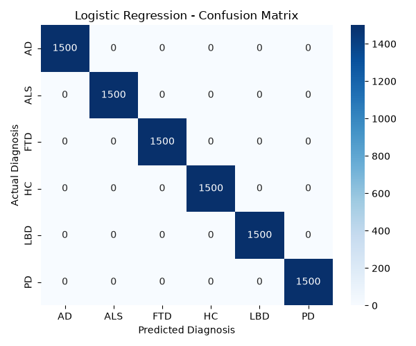
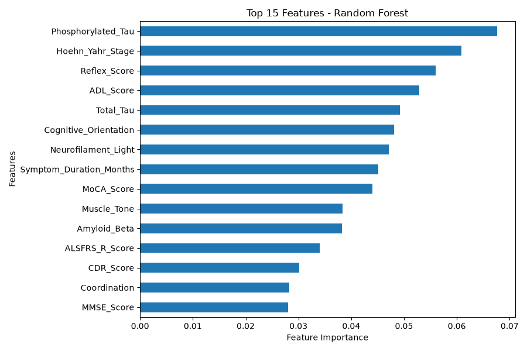
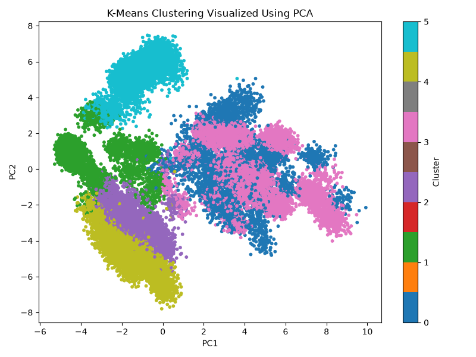

# Neurodegenerative Disease ML

Machine learning classification and clustering of neurodegenerative disorders using a Kaggle dataset.

## Dataset
The dataset used in this project is the **Neurodegenerative Disorders Dataset** from Kaggle.

Kaggle Dataset:  
https://www.kaggle.com/datasets/gowtha69/neurodegenerative-disorders-dataset

The dataset contains:
- 45,000 patient records
- 123 columns
- 6 diagnosis classes
- 7,500 records per class

### Diagnosis Classes
- AD - Alzheimer's Disease
- ALS - Amyotrophic Lateral Sclerosis
- FTD - Frontotemporal Dementia
- HC - Healthy Control
- LBD - Lewy Body Dementia
- PD - Parkinson's Disease

## Machine Learning Methods

### Classification
Three classification algorithms were used:
1. Logistic Regression
2. Random Forest
3. Support Vector Machine (SVM)

### Clustering
K-Means clustering was performed using 6 clusters.
PCA was used to visualize the resulting clusters in two dimensions.

## Classification Results
| Model | Accuracy |
|---|---:|
| Logistic Regression | 100.00% |
| Random Forest | 100.00% |
| SVM | 99.99% |

## Clustering Results
- Number of clusters: 6
- Silhouette Score: 0.1191
The clustering results showed that some clusters corresponded strongly to particular diagnosis classes, while some classes showed overlap.

## Random Forest Feature Importance
The Random Forest model was used to identify features that contributed strongly to classification.
The top features included:
- Phosphorylated Tau
- Hoehn-Yahr Stage
- Reflex Score
- ADL Score
- Total Tau
- Cognitive Orientation
- Neurofilament Light
- Symptom Duration
- MoCA Score
- Muscle Tone

## Results
### 1. Logistic Regression Confusion Matrix

### 2. Random Forest Confusion Matrix

### 3. SVM Confusion Matrix

### 4. Random Forest Feature Importance

### 5. K-Means Clustering

## Technologies
- Python
- Pandas
- Scikit-learn
- Matplotlib
- Seaborn
- KaggleHub

## Note
The very high classification performance reflects the characteristics of this particular dataset and should not be interpreted as equivalent performance on real-world clinical data.

## Author

M.Sc. Bioinformatics
